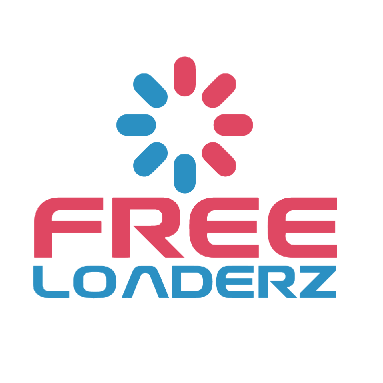

# 🌐 Welcome to Freeloaderz

Freeloaderz is a coalition of Cardano stake pool operators (SPOs), developers, and community members offering their talents and services to the Cardano community in an effort to improve the everyday user experience, promote decentralisation, and maintain the security of the network.

<figure><figcaption></figcaption></figure>

Freeloaderz believe that a vibrant, decentralised base of single stake pool operators is integral to Cardano’s success. Therefore a primary mission of the Freeloaderz DAO is to support independent stake pool operators.


Please note that none of the information in this set of documents is intended as investment advice. All digital asset projects carry a significant risk to investors: please do your own research at all times.

