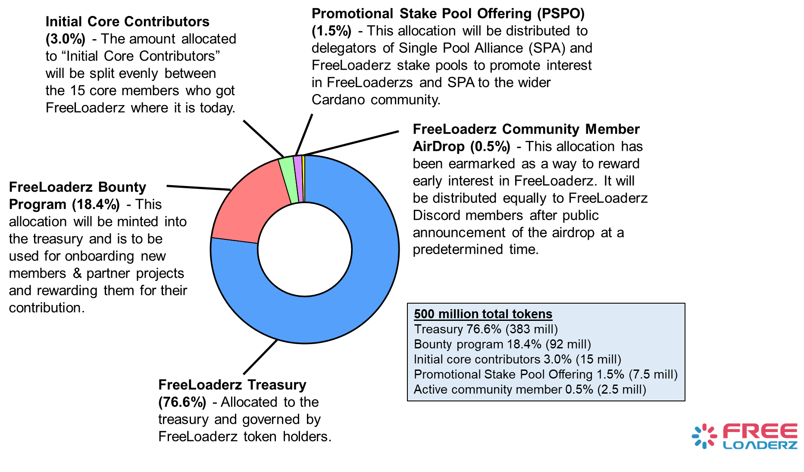

# 📄 Handbook

## Purpose of Handbook

The purpose of this handbook is to inform members of FreeLoaderz and the Cardano Community of the rights and responsibilities of participating in FreeLoaderz. It is intended to be a complement to the FreeLoaderz Constitution which can be found on Github at: https://github.com/FreeLoaderz/constitution/blob/master/FreeLoaderz-Constitution-v01.md

## Mission Statement 

FreeLoaderz originated as a coalition of Cardano stake pools offering url api access to their relay servers to help improve transaction speed by opening up ports to user wallets. As users of the Cardano network, the members of FreeLoaderz DAO, including both users and stake pool operators alike, come together to form this organization that will serve our community. Our founders originate from around the world, with different identities and experiences. We are brought together in our hope that decentralized technologies will allow us to cooperate in a renewed spirit of honesty and equality. We seek to operate our organization according to the principles made manifest in blockchain technologies. Our knowledge shall be shared, and our actions shall be auditable. Our motivations shall be transparent, and our records shall be immutable. We will provide a forum where all voices are heard, and governance that ensures that the will of the whole shall be executed. Anyone may associate or disassociate freely while we collectively build tools for everyone to use. The mantra of our organization shall be this one unrelenting quest: Decentralization Together.

## Guiding Values and History 

FreeLoaderz was established on March 2, 2022 with the generation of the FreeLoaderz Identity NFTs (one to each of the 15 founding Core Members): [https://cardanoscan.io/token/7e2aef81608f166522b59c65d83a49d2f7d2a0e9](https://cardanoscan.io/token/7e2aef81608f166522b59c65d83a49d2f7d2a0e9)

Leading up to and following the minting of the Identity NFT, FreeLoaderz became a gathering place for Cardanians interested in exploring the topic of decentralization of the transaction submission process blockchain wide on Cardano. Through discussions on Discord and public meetings on Twitter Spaces these individuals formed a working group that would become the Founding Core Contributors of FreeLoaderz.

As interest in the DAO grew more Cardanians were attracted to the group. The Cardano community recognized the potential in the organization and Partnerships were formed with other builders in the network. Community Associates turned into Active Contributors as they found ways that they could provide value to the organization.

While the Founding Core Contributors all believed in highly-distributed forms of governance, the governing script was controlled by 15 governance tokens that had been initially distributed to 15 people. This was done out of necessity because without a convenient interface for proposal interaction the script governors had to utilize the Command Line Interface for each interaction with the underlying governance script .

A governance system was developed that would be more easily accessible to all users. At the same time the DAO created identity standards, membership management, and processes for ensuring that decentralized work could be done in an efficient manner. Additionally, 500,000,000 governance tokens were minted within the FreeLoaderz Treasury that would become available for distribution.

FreeLoaderz continues to strive for full decentralization through open collaboration and events like our community airdrop of governance tokens from the Treasury. This airdrop, 1) rewarded the Founding Core Contributors for their organizational work, 2) rewarded Early Supporters for their contributions, and 3) gave any member of the broader Cardano community an opportunity to obtain tokens through an open token distribution system.

Through the process of minting the FreeLoaderz Identity Tokens, Founding Core Members ratified the FreeLoaderz Constitution and the process of token distribution and claiming the tokens. Founding Core Contributors and Early Supporter GovToken Holders are responsible for deciding the priorities of the DAO through the proposal process adopted in this Handbook for organizational structure.

### Membership 

Membership in FreeLoaderz shall be granted to any member of the Cardano community who is willing to uphold the FreeLoaderz Mission Statement and ratify the Constitution. A member of the Cardano community is defined as anyone who possesses a Cardano wallet with stake delegated to an active stake pool. There shall be no requirement to contribute time to FreeLoaderz projects or assets to the FreeLoaderz Treasury.

Members shall fall into one or more of the following categories:

1. GovToken Holders/Community Members are individuals who hold the FreeLoaderz Governance Token (FLZ). GovToken Holders are responsible for deciding the priorities of the DAO through the proposal process. No assets may be moved out of the DAO treasury without a vote of GovToken Holders and all program coordination is formalized through votes on proposals.
2. Active Contributors are community volunteers who dedicate their time to DAO projects or working groups. Individuals who contribute can claim bounties from the DAO treasury and use any GovTokens they receive to vote on what projects the DAO should work on next.
3. Core Contributors are members selected to serve as part of an advisory group. These advisors will be responsible for managing the administrative operations of FreeLoaderz, overseeing the social media and communication channels, and organizing meetings of FreeLoaderz members. Core Contributors may also be responsible for leading the Working Groups of FreeLoaderz and serve as multi-sig trustees of any Associated Contracts established by the FreeLoaderz Governing Smart Contract. Individuals will serve in this role until their term expires (called a Session), they are recalled, or they resign according to the procedures set up in the Governing Smart Contract.
4. Community Associates are any member of the Cardano community who chooses to associate with FreeLoaderz. Even if an individual does not yet hold any GovTokens they can engage in legitimate peripheral participation by engaging in community discussions, or become Active Contributors by collaborating on FreeLoaderz projects, bounties, proposals, or any other cause that helps guide DAO efforts.

### FreeLoaderz Coordination 

In order to function properly FreeLoaderz shall appoint Working Groups to carry out certain tasks. These Working Groups will run for 40 epochs, called a Session. This organizational period shall be established to enable a natural cadence of FreeLoaderz as an organization.

With a deadline of two epochs before a Session is slated to begin, FreeLoaderz members shall submit proposals detailing how the Session shall be structured. Each proposal should outline:

1. What FreeLoaderz Members shall be designated as the Core Contributors
2. What Working Groups will be funded in the Session
3. The bounty to be paid out to each Working Group
4. The Core Contributor(s) responsible for organizing each Working Group
5. The end date of each Session (which should be 40 epochs in the future unless some special circumstance dictates otherwise).

It should also be noted:

1. Working groups shall include the Finance & Governance Working Group, Development Committee Working Group, and Marketing & Community Working Group.
2. Ad-hoc Working Groups may be formed as needs arise through the proposal process (see Proposal Standards section).
3. Addition or removal of any members to Working Groups that are already in Session must be made by supermajority vote (>60%) of the Core Contributors, with at least half of the Core Contributors participating in the vote.
4. One member from each Working Group will be appointed as a member of the Steering Committee, whose responsibilities will be to make administrative decisions regarding delegation of project duties, working with Working Groups on best efforts for completion of projects, reviewing proposals to delegate to respective Working Groups, and aid in coordinating partnerships with potential collaborators.

Voting for Session proposals shall be on-chain with Gov Tokens. The voting period begins one epoch before the start of the Session and ends 24 hours before the Session is slated to begin. One winner will be picked according to the rules of the Primary Smart Contract and competing proposals will be discarded. While the Core Contributors will be expected to put forth a proposal for the coming Session, competing proposals may be submitted by any FreeLoaderz member.

The designated bounties shall be paid from the FreeLoaderz Treasury into Associated Smart Contracts immediately upon passage of a proposal. These contracts shall have trusted FreeLoaderz members designated as Bounty Judges who will control disbursement of the funds. The contracts will also have an expiration date encoded, after which time any Cardano wallet can be used to send the unspent funds back to the FreeLoaderz treasury. If any FreeLoaderz members believe that the funds were awarded unwisely by the muti-signatories they may appeal to the other members to hold them accountable when considering future bounties.

### FreeLoaderz (FLZ) Tokenomics and Vesting 

<figure><figcaption></figcaption></figure>
