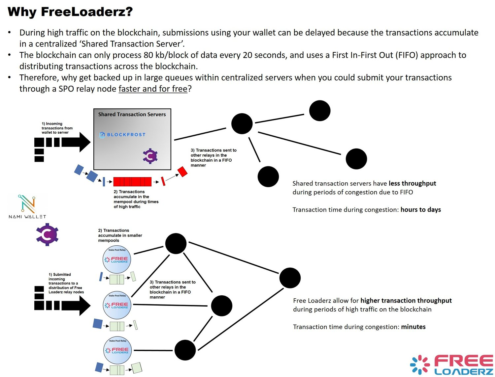

# 🏋 Load Balancers

<figure><figcaption></figcaption></figure>

## **The Problem:**

When transactions are submitted, they often are processed through one system’s servers (referred from here on as relays). For example, if you submit a transaction via Nami wallet, it would be submitted to Blockfrost’s relays, meaning that during time of congestion, thousands of transactions are waiting in line to go through Blockfrost relay node’s transaction queue, called the mempool.

## **The solution:**

Every stake pool should have at least one relay at minimum, and many pools have 2-5 for redundancy. This means there are probably over 10,000 relays worldwide, each with the same ability to help with transaction submission processing. Every stake pool operator (SPO) can enable or install, if not already installed, the necessary program to run the transaction submission for the everyday user, called cardano-submit-api. This allows users to input the ip address of any participating stake pool whose relay node is running cardano-submit-api into their wallet and submit transactions using SPO relay node mempools, thereby skipping the long mempool queues at Blockfrost and other relay nodes and allowing for faster transaction times.

## **What is the Freeloaderz Advantage over using a Single SPO’s relay?**

While SPOs could solely provide the cardano-submit-api to their users, this may also cause a bottleneck if that single relay node can’t keep up with the number of transactions being submitted to its mempool, or if the relay may need to go down for maintenance. Because of this, Freeloaderz created a load balancer that evenly distributes transactions across a pool of more than 40 participating SPO relay nodes, each running cardano-submit-api, which combined may already be processing over 25,000 submit transactions per day. Extrapolate this to 2,500 relays and imagine how many transactions per day can be processed in a decentralized way across the entire Cardano blockchain.

## **Why Should an SPO join Freeloaderz?**

First, by joining FreeLoaderz, the combined resources of participating SPOs will help spread out transaction submissions across the network, thus helping users and delegators get the quickest transactions possible through our combined resources.

In addition, there are several projects interested in utilizing the FreeLoaderz load balancer service to deploy their projects, such as NFT marketplaces and token projects wanting to do airdrops or token reward withdrawals via a vending machine-like platform. Any application or project wanting to allow for a more decentralized way to carry out transactions or to deploy tokens is able to use FreeLoaderz. For offering this service, projects are thinking about offering tokens rewards to delegators of participating FreeLoaderz pools, which may help participating pools attract new delegators as well!

## Using SPO URL Endpoints for Transactions

For daily transactions, you can connect your Nami or Eternl wallets to participating SPO relay node url addresses to help increase transaction throughput and decentralize the transaction submission process. See below for more information!

## Using Proxy URLs for Transactions

You can also connect your wallet directly to our proxy url addresses (USA and Europe urls), which handles distributing transactions across the participating FreeLoaderz SPO relay nodes, making the process more simple for the everyday user.

**Configure your wallet to:**

`https://usa.freeloaderz.io/api/submit/tx`

`https://europe.freeloaderz.io/api/submit/tx`

`https://sg.freeloaderz.io/api/submit/tx`

## View the live Dashboards below (updated every 60 secs)







## View FreeLoaderz Live Statistics Charts:


