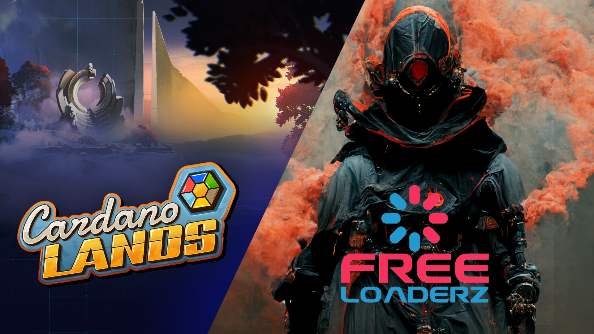

# 🥽 NFT Utility Explained

## SmartClaimz discount utility&#x20;

#### Holders of LoadWarrior NFTs can access SmartClaimz and claim at a discounted rate.&#x20;

For Series 1 (total supply 250 NFTs) the available discount rates are as follows:

* 25 NFTs @50% Discount (10% of supply)
* 75 NFTs @25% Discount (30% of supply)
* 150 NFTs @10% Discount (60% of supply)

For Series 2 (total supply 1250 NFTs) the available discount rates are as follows:

* 125 NFTs @50% Discount (10% of supply)
* 375 NFTs @25% Discount (30% of supply)
* 750 NFTs @10% Discount (60% of supply)

Simply connect your NFT-containing wallet to [https://smartclaimz.io/](https://smartclaimz.io/) and claim at discounted rates. Please remember that tokens on SmartClaimz accumulate, so you can claim less frequently and save transaction fees.

<figure><figcaption></figcaption></figure>

## Staking utility

#### Freeloaderz has partnered with CardanoLands to offer our NFT holders a second utility layer: LoadWarriors can be staked on CardanoLands to generate a recurring cashflow.


Please note that this utility is currently only available to Series 2 holders. We are working on extending this utility back to Series 1 as well.


CardanoLands is the first NFT Staking DeFi Hub on Cardano: the platform provides an intuitive and fun way to provide liquidity and earn rewards.


NFTs will never leave the users’ wallet and can still be traded.


Holders of LoadWarriors can stake them on [https://cardanolands.com/](https://cardanolands.com/) by simply connecting their wallet containing the NFTs. Holders are rewarded with $HEXO, an in-game currency for CardanoLands and can claim their rewards cumulatively, as long as they log on with their wallet once a month.

$HEXO can be used to play a crafting game, which gives a chance for $ADA and other rewards through a raffle system.&#x20;

Users of CardanoLands can also choose to vote for Freeloaderz LoadWarriors as their favourite project using $EXO, a second token native to CardanoLands used for governance.


Example, based on HEXO-ADA pair exchange rate and Mining Power of NFTs at the time of writing:

**10 NFTs (25 ADA ea) = 27.4 HEXO per day = 0.011 ADA per day** (Updated 23.03.2023)

This approximately equates to 4 ADA per year on a 250 ADA investment (approx 1.6% APY)



Please note that these figures will change based on HEXO market value and NFT mining power.


Also note that the figures above are assuming the NFT holder does little to participate in game other than claiming HEXO and trade HEXO for ADA on a DEX.&#x20;

#### Holders who actually play the game could see their rewards go higher.

More information about CardanoLands can be found at: [https://whitepaper.cardanolands.com/](https://whitepaper.cardanolands.com/)

<figure><figcaption></figcaption></figure>
